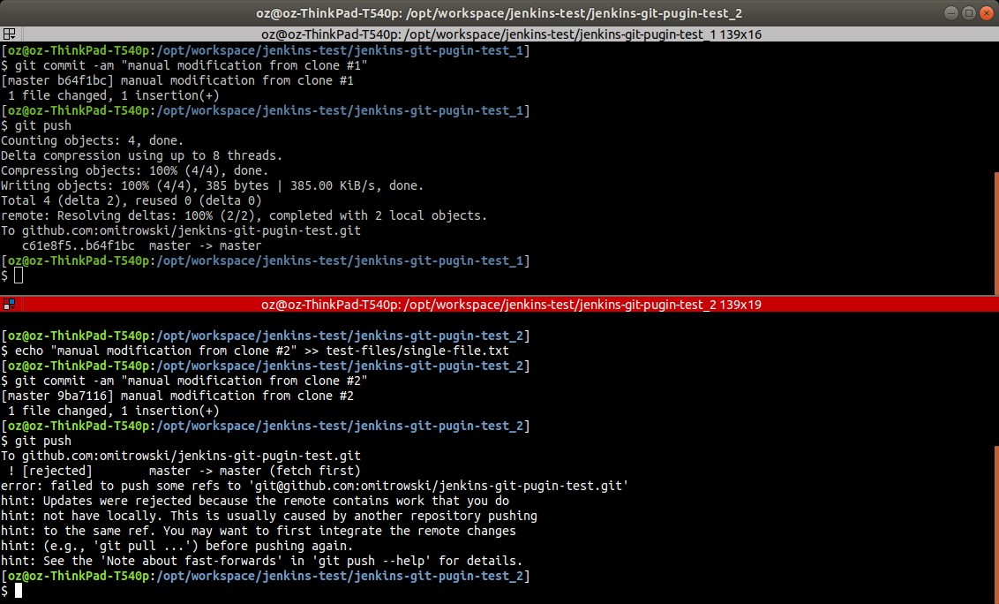
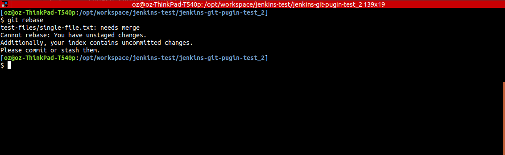
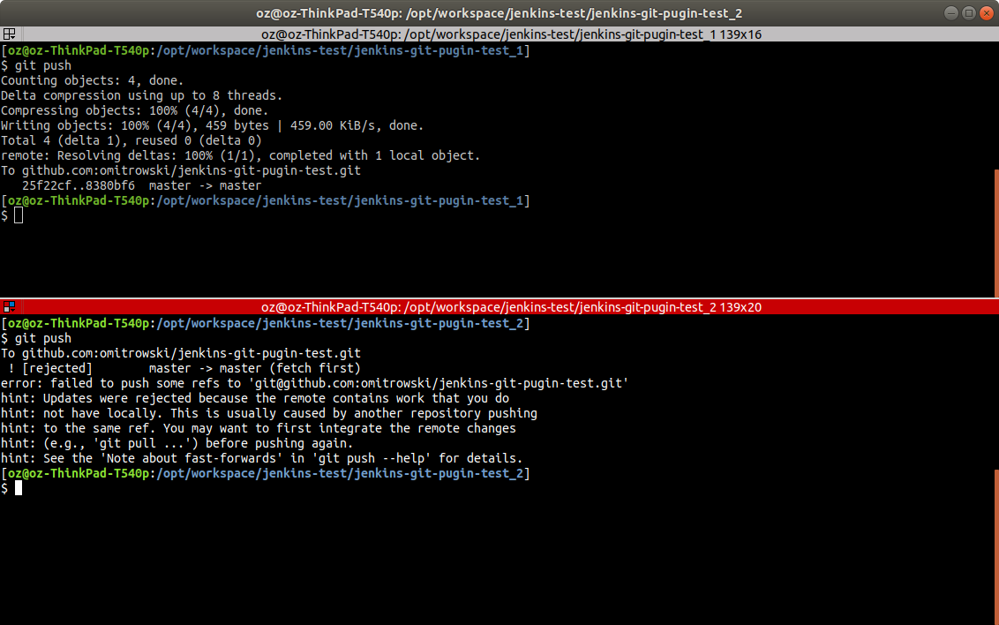
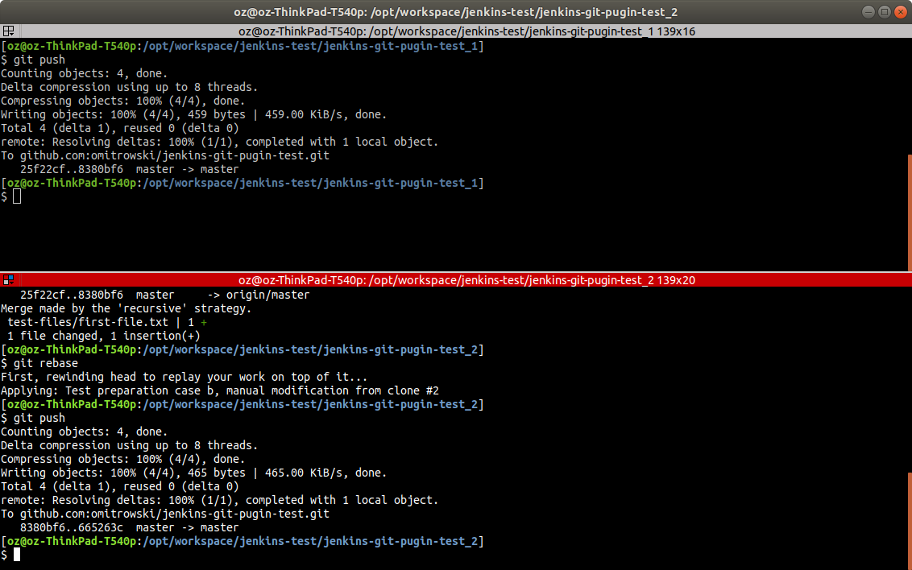

Jenkins test environment for git plugin merge request
===================================
<!-- TOC depthFrom:1 depthTo:6 withLinks:1 updateOnSave:1 orderedList:1 -->

- [Purpose](#purpose)
- [Use case](#use-case)
- [Test preparation](#test-preparation)
- [Test scenario](#test-scenario)
- [Test environment](#test-environment)
- [Test cases](#test-cases)
- [Results](#results)
  - [Test preparation results](#test-preparation-results)
    - [Case 1.a (Screen: `results/preparation/case-1a/`)](#case-1a-screen-resultspreparationcase-1a)

<!-- /TOC -->

# Purpose
Test merge request https://github.com/jenkinsci/git-plugin/pull/694 for Jenkins git-plugin

# Use case
Using same git repo in different Jenkins jobs causes git rejection while executing git push in case several jobs running at the same time modify something in the repo and try to push their changes. First one pushing wins, other are rejected.

# Test preparation
1. Determination of the expectations for test results of the merge request. The following test variants represents decisive. Their results represents the expected results of tests in Jenkins. Having two clones of this repo locally:
  - **Case a.** in both clones the same file (`test-files/single-file.txt`) is going to be modified due to appending new rows. From first clone we perform a `git pull && git push` and afterwards we try a `git pull && git rebase && git push`` on the second repo clone. In this case a auto merge on rebase should be possible.
  - **Case b.** in both clones two different files (`test-files/first-file.txt`,`test-files/second-file.txt`, each one in different git clone folder) are going to be modified due to appending new rows. From first clone we perform a `git pull && git push` and afterwards we try a `git pull && git rebase && git push`` on the second repo clone.  In this case a auto merge on rebase should be possible.
  - **Case c.** in both clones the same file (`test-files/single-file.txt`) is going to be modified due to replacing all rows. From first clone we perform a `git pull && git push` and afterwards we try a `git pull && git rebase && git push`` on the second repo clone.  In this case a auto merge on rebase should be not possible.
2. A local Jenkins installation is used via docker (`https://hub.docker.com/r/jenkins/jenkins`) managed by docker-compose (`docker-compose.yml`).


# Test environment
- Operating System: Linux, Ubuntu 18.04.2 LTS
- Kernel Version: 4.18.0-18-generic
- Architecture: x86_64
- CPUs: 8
- Total Memory: 15.36GiB
- Docker version: 18.09.2
- Git versions:
  - locally: 2.17.1
  - remote: github.com
- Jenkins version: 2.174
  - For all test cases:
    - Installation procedure: default plugin selection
  - For test case 2 (Jenkins with git-plugin including rebase patch):
    - Post installation of git client v3.0.0-beta9-rc1944 over v2.7.7 from https://ci.jenkins.io/job/Plugins/job/git-client-plugin/job/master/295/artifact/org/jenkins-ci/plugins/git-client/3.0.0-beta9-rc1944.926401690c63/git-client-3.0.0-beta9-rc1944.926401690c63.hpi
    - Post installation of git plugin v4.0.0-beta9-rc3094 over v3.9.4 from https://ci.jenkins.io/job/Plugins/job/git-plugin/job/PR-694/5/artifact/org/jenkins-ci/plugins/git/4.0.0-beta9-rc3094.5a8adf136d1b/git-4.0.0-beta9-rc3094.5a8adf136d1b.hpi


# Test preparation results

### Case a (Details: [results/preparation/case-a/CASE-A.md][e8a25f3b])

**1.** As expected git push have been rejected from second git repo clone
- 

**2.** Not as expected rebase auto-merge failed
- 

**3.** Accordingly case **Case c.** is obsolete.

### Case a (Details: [results/preparation/case-b/CASE-B.md][9dbffb0f])

**1.** As expected git push have been rejected from second git repo clone
- 

**2.** As expected git push have been accepted after `git pull && git rebase` from second git repo clone
- 


# Test scenario
Two similar Jenkins jobs using the same (this) git repository are triggered simultaneously via a trigger job.
`Job A` has a sleep time of 60 seconds, `Job B` a sleep time of 20 seconds. Both jobs will be set up to push their modifications after sleep time expires.

# Test cases
As result of the the preparation process the following test cases and expected results have been determinated:

**1. Jenkins with git-plugin excluding rebase patch:**
  - **Test Case 1.a.** both jobs are going to modify the same file (`test-files/single-file.txt`) appending new rows.
    - Expected result: git push rejected for `Job A`, but accepted for `Job B`
  - **Test Case 1.b.** both jobs are going to modify two different files (`test-files/first-file.txt`,`test-files/second-file.txt`,each one a different in different job) appending new rows.
    - Expected result: git push rejected for `Job A`, but accepted for `Job B`

**2. Jenkins with git-plugin including rebase patch but option `rebase before push` not activated:**
  - **Test Case 2.a.** both jobs are going to modify the same file (`test-files/single-file.txt`) appending new rows.
    - Expected result: git push rejected for `Job A`, but accepted for `Job B`
  - **Test Case 2.b.** both jobs are going to modify two different files (`test-files/first-file.txt`,`test-files/second-file.txt`,each one a different in different job) appending new rows.
    - Expected result: git push rejected for `Job A`, but accepted for `Job B`

**3. Jenkins with git-plugin including rebase patch and activated option `rebase before push`:**
  - **Test Case 3.a.** both jobs are going to modify the same file (`test-files/single-file.txt`) appending new rows.
    - Expected result: git push rejected for `Job A`, but accepted for `Job B`
  - **Test Case 3.b.** both jobs are going to modify two different files (`test-files/first-file.txt`,`test-files/second-file.txt`,each one a different in different job) appending new rows.
    - Expected result: git push accepted for `Job A` and `Job B`

# Test results

## Case 1.a. (Details: results/tests-1.a)
  - Expected result: git push rejected for `Job A`, but accepted for `Job B`
  - **Tested OK**
  - Job A
```bash
17:19:44  > git push git@github.com:omitrowski/jenkins-git-pugin-test.git HEAD:master
17:19:46 ERROR: Failed to push branch master to origin
17:19:46 hudson.plugins.git.GitException: Command "git push git@github.com:omitrowski/jenkins-git-pugin-test.git HEAD:master" returned status code 1:
17:19:46 stdout:
17:19:46 stderr: To github.com:omitrowski/jenkins-git-pugin-test.git
17:19:46  ! [rejected]        HEAD -> master (fetch first)
17:19:46 error: failed to push some refs to 'git@github.com:omitrowski/jenkins-git-pugin-test.git'
17:19:46 hint: Updates were rejected because the remote contains work that you do
17:19:46 hint: not have locally. This is usually caused by another repository pushing
17:19:46 hint: to the same ref. You may want to first integrate the remote changes
17:19:46 hint: (e.g., 'git pull ...') before pushing again.
17:19:46 hint: See the 'Note about fast-forwards' in 'git push --help' for details.
```
  - Job B
```bash
17:19:04 + git commit -am 'modification from Jenkins Test case 1.x/Test Job B - Test case 1a (5)'
17:19:04 [detached HEAD 4f16fa8] modification from Jenkins Test case 1.x/Test Job B - Test case 1a (5)
17:19:04  1 file changed, 1 insertion(+)
17:19:04 using credential jenkins-ssh-key
17:19:04 Pushing HEAD to branch master at repo origin
17:19:04  > git --version # timeout=10
17:19:04 using GIT_SSH to set credentials jenkins-pk
17:19:04  > git push git@github.com:omitrowski/jenkins-git-pugin-test.git HEAD:master
17:19:08 Finished: SUCCESS
```

## Case 1.b. (Details: results/tests-1.b)
  - Expected result: git push rejected for `Job A`, but accepted for `Job B`
  - **Tested OK**
  - Job A
```bash
17:31:44  > git push git@github.com:omitrowski/jenkins-git-pugin-test.git HEAD:master
17:31:46 ERROR: Failed to push branch master to origin
17:31:46 hudson.plugins.git.GitException: Command "git push git@github.com:omitrowski/jenkins-git-pugin-test.git HEAD:master" returned status code 1:
17:31:46 stdout:
17:31:46 stderr: To github.com:omitrowski/jenkins-git-pugin-test.git
17:31:46  ! [rejected]        HEAD -> master (fetch first)
17:31:46 error: failed to push some refs to 'git@github.com:omitrowski/jenkins-git-pugin-test.git'
17:31:46 hint: Updates were rejected because the remote contains work that you do
17:31:46 hint: not have locally. This is usually caused by another repository pushing
17:31:46 hint: to the same ref. You may want to first integrate the remote changes
17:31:46 hint: (e.g., 'git pull ...') before pushing again.
17:31:46 hint: See the 'Note about fast-forwards' in 'git push --help' for details.
```
  - Job B
```bash
17:31:04 + git commit -am 'modification from Jenkins Test case 1.x/Test Job B - Test case 1b (1)'
17:31:04 [detached HEAD b89755d] modification from Jenkins Test case 1.x/Test Job B - Test case 1b (1)
17:31:04  1 file changed, 1 insertion(+)
17:31:04 using credential jenkins-ssh-key
17:31:04 Pushing HEAD to branch master at repo origin
17:31:04  > git --version # timeout=10
17:31:04 using GIT_SSH to set credentials jenkins-pk
17:31:04  > git push git@github.com:omitrowski/jenkins-git-pugin-test.git HEAD:master
17:31:08 Finished: SUCCESS
```

## Case 2.a. (Details: results/tests-2.a)
  - Expected result: git push rejected for `Job A`, but accepted for `Job B`
  - **Tested OK**
  - Job A
```bash
17:47:52  > git push git@github.com:omitrowski/jenkins-git-pugin-test.git HEAD:master # timeout=10
17:47:54 ERROR: Failed to push branch master to origin
17:47:54 hudson.plugins.git.GitException: Command "git push git@github.com:omitrowski/jenkins-git-pugin-test.git HEAD:master" returned status code 1:
17:47:54 stdout:
17:47:54 stderr: To github.com:omitrowski/jenkins-git-pugin-test.git
17:47:54  ! [rejected]        HEAD -> master (fetch first)
17:47:54 error: failed to push some refs to 'git@github.com:omitrowski/jenkins-git-pugin-test.git'
17:47:54 hint: Updates were rejected because the remote contains work that you do
17:47:54 hint: not have locally. This is usually caused by another repository pushing
17:47:54 hint: to the same ref. You may want to first integrate the remote changes
17:47:54 hint: (e.g., 'git pull ...') before pushing again.
17:47:54 hint: See the 'Note about fast-forwards' in 'git push --help' for details.
```
  - Job B
```bash
17:47:13 + git commit -am 'modification from Jenkins Test case 2.x/Test Job B - Test case 1a (1)'
17:47:13 [detached HEAD 4831e71] modification from Jenkins Test case 2.x/Test Job B - Test case 1a (1)
17:47:13  1 file changed, 1 insertion(+)
17:47:13 using credential jenkins-ssh-key
17:47:13 Pushing HEAD to branch master at repo origin
17:47:13  > git --version # timeout=10
17:47:13 using GIT_SSH to set credentials jenkins-pk
17:47:13  > git push git@github.com:omitrowski/jenkins-git-pugin-test.git HEAD:master # timeout=10
```

## Case 2.b. (Details: results/tests-2.b)
  - Expected result: git push rejected for `Job A`, but accepted for `Job B`
  - **Tested OK**
  - Job A
```bash
17:52:13  > git push git@github.com:omitrowski/jenkins-git-pugin-test.git HEAD:master # timeout=10
17:52:14 ERROR: Failed to push branch master to origin
17:52:14 hudson.plugins.git.GitException: Command "git push git@github.com:omitrowski/jenkins-git-pugin-test.git HEAD:master" returned status code 1:
17:52:14 stdout:
17:52:14 stderr: To github.com:omitrowski/jenkins-git-pugin-test.git
17:52:14  ! [rejected]        HEAD -> master (fetch first)
17:52:14 error: failed to push some refs to 'git@github.com:omitrowski/jenkins-git-pugin-test.git'
17:52:14 hint: Updates were rejected because the remote contains work that you do
17:52:14 hint: not have locally. This is usually caused by another repository pushing
17:52:14 hint: to the same ref. You may want to first integrate the remote changes
17:52:14 hint: (e.g., 'git pull ...') before pushing again.
17:52:14 hint: See the 'Note about fast-forwards' in 'git push --help' for details.
```
  - Job B
```bash
17:51:32 + git commit -am 'modification from Jenkins Test case 2.x/Test Job B - Test case 1b (1)'
17:51:32 [detached HEAD 1fb41db] modification from Jenkins Test case 2.x/Test Job B - Test case 1b (1)
17:51:32  1 file changed, 1 insertion(+)
17:51:32 using credential jenkins-ssh-key
17:51:32 Pushing HEAD to branch master at repo origin
17:51:32  > git --version # timeout=10
17:51:32 using GIT_SSH to set credentials jenkins-pk
17:51:32  > git push git@github.com:omitrowski/jenkins-git-pugin-test.git HEAD:master # timeout=10
17:51:35 Finished: SUCCESS
```

## Case 3.a. (Details: results/tests-3.a)
  - Expected result: git push rejected for `Job A`, but accepted for `Job B`
  - **Tested OK**
  - Job A
```bash
18:14:32  > git fetch --tags --progress git@github.com:omitrowski/jenkins-git-pugin-test.git +refs/heads/*:refs/remotes/origin/* # timeout=10
18:14:34  > git rev-parse HEAD^{commit} # timeout=10
18:14:34  > git rev-parse origin/master^{commit} # timeout=10
18:14:34  > git rebase origin/master # timeout=10
18:14:34  > git rebase --abort # timeout=10
18:14:34 ERROR: Failed to push branch master to origin
18:14:34 hudson.plugins.git.GitException: Could not rebase origin/master
18:14:34 	at org.jenkinsci.plugins.gitclient.CliGitAPIImpl$4.execute(CliGitAPIImpl.java:831)
18:14:34 	at hudson.plugins.git.GitPublisher.perform(GitPublisher.java:310)
18:14:34 	at hudson.tasks.BuildStepMonitor$1.perform(BuildStepMonitor.java:20)
18:14:34 	at hudson.model.AbstractBuild$AbstractBuildExecution.perform(AbstractBuild.java:741)
18:14:34 	at hudson.model.AbstractBuild$AbstractBuildExecution.performAllBuildSteps(AbstractBuild.java:690)
18:14:34 	at hudson.model.Build$BuildExecution.post2(Build.java:186)
18:14:34 	at hudson.model.AbstractBuild$AbstractBuildExecution.post(AbstractBuild.java:635)
18:14:34 	at hudson.model.Run.execute(Run.java:1843)
18:14:34 	at hudson.model.FreeStyleBuild.run(FreeStyleBuild.java:43)
18:14:34 	at hudson.model.ResourceController.execute(ResourceController.java:97)
18:14:34 	at hudson.model.Executor.run(Executor.java:429)
18:14:34 Caused by: hudson.plugins.git.GitException: Command "git rebase origin/master" returned status code 128:
18:14:34 stdout: First, rewinding head to replay your work on top of it...
18:14:34 Applying: modification from Jenkins Test case 3.x/Test Job A - Test case 3a (1)
18:14:34 Using index info to reconstruct a base tree...
18:14:34 M	test-files/single-file.txt
18:14:34 Falling back to patching base and 3-way merge...
18:14:34 Auto-merging test-files/single-file.txt
18:14:34 CONFLICT (content): Merge conflict in test-files/single-file.txt
18:14:34 Patch failed at 0001 modification from Jenkins Test case 3.x/Test Job A - Test case 3a (1)
18:14:34 The copy of the patch that failed is found in: .git/rebase-apply/patch
18:14:34
18:14:34 When you have resolved this problem, run "git rebase --continue".
18:14:34 If you prefer to skip this patch, run "git rebase --skip" instead.
18:14:34 To check out the original branch and stop rebasing, run "git rebase --abort".
```
  - Job B
```bash
18:13:53  > git fetch --tags --progress git@github.com:omitrowski/jenkins-git-pugin-test.git +refs/heads/*:refs/remotes/origin/* # timeout=10
18:13:54  > git rev-parse HEAD^{commit} # timeout=10
18:13:54  > git rev-parse origin/master^{commit} # timeout=10
18:13:54  > git rebase origin/master # timeout=10
18:13:54 Pushing HEAD to branch master at repo origin
18:13:54 using GIT_SSH to set credentials jenkins-pk
18:13:54  > git push git@github.com:omitrowski/jenkins-git-pugin-test.git HEAD:master # timeout=10
18:13:57 Finished: SUCCESS
```

## Case 3.b. (Details: results/tests-3.b)
  - Expected result: git push accepted for `Job A` and `Job B`
  - **Tested OK**
  - Job A
```bash
18:19:17  > git fetch --tags --progress git@github.com:omitrowski/jenkins-git-pugin-test.git +refs/heads/*:refs/remotes/origin/* # timeout=10
18:19:19  > git rev-parse HEAD^{commit} # timeout=10
18:19:19  > git rev-parse origin/master^{commit} # timeout=10
18:19:19  > git rebase origin/master # timeout=10
18:19:19 Pushing HEAD to branch master at repo origin
18:19:19 using GIT_SSH to set credentials jenkins-pk
18:19:19  > git push git@github.com:omitrowski/jenkins-git-pugin-test.git HEAD:master # timeout=10
18:19:22 Finished: SUCCESS
```
  - Job B
```bash
18:18:38  > git fetch --tags --progress git@github.com:omitrowski/jenkins-git-pugin-test.git +refs/heads/*:refs/remotes/origin/* # timeout=10
18:18:39  > git rev-parse HEAD^{commit} # timeout=10
18:18:39  > git rev-parse origin/master^{commit} # timeout=10
18:18:39  > git rebase origin/master # timeout=10
18:18:39 Pushing HEAD to branch master at repo origin
18:18:39 using GIT_SSH to set credentials jenkins-pk
18:18:39  > git push git@github.com:omitrowski/jenkins-git-pugin-test.git HEAD:master # timeout=10
18:18:42 Finished: SUCCESS
```

## Final git repo log
```bash
* 41af67f modification from Jenkins Test case 3.x/Test Job A - Test case 3b (1)
* d6de91f modification from Jenkins Test case 3.x/Test Job B - Test case 3b (1)
* 2615e10 modification from Jenkins Test case 3.x/Test Job B - Test case 3a (1)
* 1fb41db modification from Jenkins Test case 2.x/Test Job B - Test case 1b (1)
* 4831e71 modification from Jenkins Test case 2.x/Test Job B - Test case 1a (1)
* b89755d modification from Jenkins Test case 1.x/Test Job B - Test case 1b (1)
* 4f16fa8 modification from Jenkins Test case 1.x/Test Job B - Test case 1a (5)
* 89c6a10 modification from Jenkins  (4)
* 1f248ae modification from Jenkins  (3)
* 7160927 modification from Jenkins  (2)
* 94d2b61 [MOD] some editing
* 869caab [MOD] Test preparation case b
* 665263c Test preparation case b, manual modification from clone #2
* 8380bf6 Test preparation case b, manual modification from clone #1
* 25f22cf [FIX] reset first file
* 659685b [MOD] Test preparation case a
*   7d4cd7d Merge branch 'master' of github.com:omitrowski/jenkins-git-pugin-test
|\
| * b64f1bc manual modification from clone #1
* | 9ba7116 manual modification from clone #2
|/
* c61e8f5 [MOD] readme formatting
* 0b15f4f [ADD] test scenario ideas
* 3da336b Initial commit
[oz@oz-ThinkPad-T540p:/opt
```

# Conclusions

 - The patch from the merge request behaves predictable and meets the expected functionality.
 - It does not change the git plugin behavior if option `rebase before push` is not activated.
 - In case of errors the messages are understandable and helpful.
 - As expected in the git log you don't see merges on successful rebase.

[e8a25f3b]: results/preparation/case-a/CASE-A.md "CASE-A.md"
[9dbffb0f]: results/preparation/case-b/CASE-B.md "CASE-B.md"
