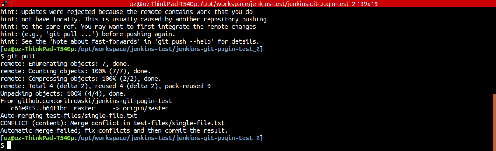
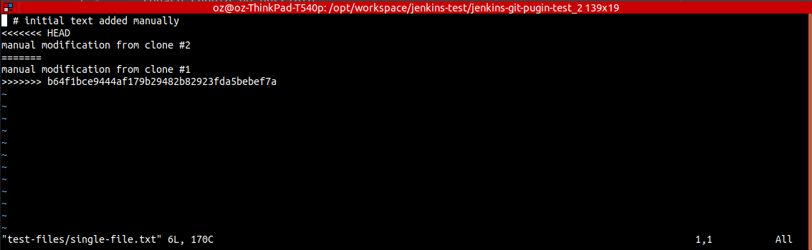

### Modify file, commit and push in both repository clones. First push from `jenkins-git-pugin-test_1` clone.


### From `jenkins-git-pugin-test_2` git pull


### From `jenkins-git-pugin-test_2` git rebase


### From `jenkins-git-pugin-test_2` merge


### From `jenkins-git-pugin-test_2` git commit and push merged


### Git log snipped
`cat results/preparation/case-a/6-git.log`
```shell
*   7d4cd7d (HEAD -> master, origin/master, origin/HEAD) Merge branch 'master' of github.com:omitrowski/jenkins-git-pugin-test
|\
| * b64f1bc manual modification from clone #1
* | 9ba7116 manual modification from clone #2
|/
```
