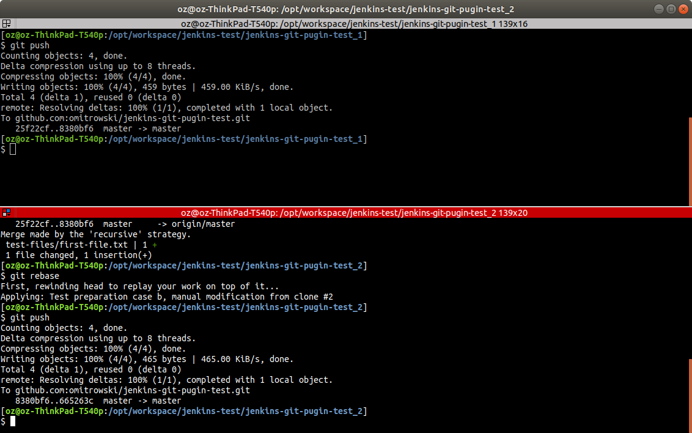

### Ensure clean status on both repo clones


### Modify different files in both repo clones and commit


### Git push from both repo clones


### From `jenkins-git-pugin-test_2` git pull and git rebase


### From `jenkins-git-pugin-test_2` git push after successful git rebase


### Git log, last two commits
`results/preparation/case-b/5-git.log`
```bash
commit 665263c9398eec8a4ccee1d01d267b8b4667893f
Author: Oskar <o.mitrowski@gmail.com>
Date:   Sun Apr 28 15:02:40 2019 +0200

    Test preparation case b, manual modification from clone #2

commit 8380bf6cf2d91f3f0b50eacd5fef26b821cb5b64
Author: Oskar <o.mitrowski@gmail.com>
Date:   Sun Apr 28 15:02:35 2019 +0200

    Test preparation case b, manual modification from clone #1
```

### Git log showing history after rebase

